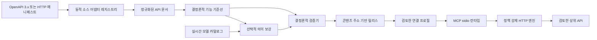

[English](README.md) | **한국어**

# HiMCP

[](https://github.com/efficjump/hi-mcp/actions/workflows/ci.yml)
[](LICENSE)
[](#프로젝트-상태)

**검토한 API 계약을 검증된 MCP 도구로 변환합니다.**

HiMCP는 OpenAPI 3.x 문서와 선언형 HTTP 매니페스트를 콘텐츠 주소 기반 릴리스로 컴파일한 뒤, 운영자가 승인한 작업만 Model Context Protocol(MCP) stdio로 제공합니다. 실행 가능한 HTTP 동작은 결정론적으로 도출하고 사용 전에 검증합니다. 선택적 모델 지원은 의미 메타데이터를 개선할 수 있지만 목적지, 인증, 요청 바인딩, 강제 위험 정책은 바꿀 수 없습니다.

> [!WARNING]
> HiMCP는 로컬 개발과 평가를 위한 초기 알파 소프트웨어입니다. 1.0 이전에는 릴리스 형식과 패키지 API가 바뀔 수 있습니다. 실제 API를 연결하기 전에 소스 계약, 선택한 작업, 정확한 origin, 확인 정책, 자격 증명 환경 변수 바인딩을 검토하세요.

## 소스에서 빠르게 시작하기

현재는 이 소스 저장소에서 배포합니다. Node.js 22 이상과 빌드 가능한 체크아웃이 필요하며, Corepack이 저장소에 선언된 pnpm 버전을 선택합니다.

```bash
git clone https://github.com/efficjump/hi-mcp.git
cd hi-mcp
corepack enable
pnpm install --frozen-lockfile
pnpm build
pnpm web
```

`http://127.0.0.1:4173`을 여세요. 설정 콘솔은 루프백 전용이며 역방향 프록시나 공개 호스팅으로 노출하면 안 됩니다. `HIMCP_WEB_PORT`로 다른 루프백 포트, `HIMCP_WEB_DATA_DIR`로 관리 산출물 디렉터리를 지정할 수 있습니다.

## HiMCP가 하는 일



- 소스 레지스트리는 유일하게 호환되는 어댑터를 고르거나 명시한 어댑터 ID를 사용합니다. 기본 어댑터는 OpenAPI 3.x와 HiMCP HTTP 매니페스트를 지원합니다.
- 이식 가능한 Capability IR이 소스 파싱, 의미 보강, 검증, MCP 전송, HTTP 실행을 분리합니다.
- 선택적 의미 공급자는 현재 모델 카탈로그를 동적으로 찾으며, 모델 출력은 이름·설명·의도·예시·스키마 주석으로 제한합니다.
- 검증기가 소스 출처, 실행 계약, 위험 정책, 릴리스 정체성을 정규 지문으로 묶습니다.
- 로컬 콘솔에서 내보내기 전에 정확한 작업, origin, 자격 증명 환경 변수 이름, 확인 정책을 검토합니다.
- 런타임은 MCP 입력과 상위 응답을 검증하고 실행 시점에만 자격 증명을 해석하며, 비공개 목적지를 막고 기본적으로 리디렉션을 거부합니다.

자동 감지는 등록된 어댑터 하나만 명확히 가장 높은 점수를 얻을 때 성공합니다. 알 수 없거나 모호하면 닫힌 상태로 실패하므로 자동화에서 모호함을 피하려면 `--source-type`을 명시하세요.

## 지원 범위

| 영역 | 현재 지원 |
| --- | --- |
| API 소스 | OpenAPI 3.x, 선언형 HiMCP HTTP 매니페스트 |
| 실행 | 검증된 요청·응답 계약을 가진, 검토된 HTTP(S) 작업 |
| MCP 전송 | 로컬 stdio |
| 자격 증명 | 환경 변수 기반 API 키, Basic/Bearer 정보, 기존 OAuth/OIDC bearer 토큰 |
| 모델 사용 | 선택적인 공급자 중립 의미 메타데이터 보강 |
| 로컬 콘솔 | 루프백 전용 소스 분석, 작업·연결 검토, descriptor 내보내기 |
| 미지원 | 원격·다중 사용자 콘솔, OAuth 생명주기, multipart, streaming, native gRPC, WebSocket, 임의 SDK·코드 실행, 게시자 증명 |

HTTP 매니페스트는 REST 호출, HTTP 기반 GraphQL, 명시적 SOAP/XML 요청, form·JSON 본문, 텍스트, 정규 base64 요청 바이트를 표현할 수 있습니다. 지원하지 않는 전송을 임의 코드로 우회하지 않고 거부합니다.

## 컴파일하고 연결하기

루트의 `pnpm himcp` 명령은 빌드된 CLI를 실행합니다. 생성한 릴리스, 프로필, 프리셋, 실행 descriptor는 Git에서 무시하는 `.himcp/`에 보관하세요.

```bash
mkdir -p .himcp/quickstart

pnpm himcp analyze \
  examples/customer-support/openapi.yaml \
  --source-type auto

pnpm himcp compile \
  examples/weather-api/http-manifest.yaml \
  --source-type http-manifest \
  --output .himcp/quickstart/weather.release.json

pnpm himcp validate \
  .himcp/quickstart/weather.release.json \
  --source examples/weather-api/http-manifest.yaml \
  --source-type http-manifest
```

모든 정확한 origin과 인증 요구 사항을 검토한 뒤 연결 프로필을 만드세요.

```bash
pnpm himcp connection create \
  .himcp/quickstart/weather.release.json \
  --name "Weather API" \
  --approve-origin https://weather.example.com \
  --output .himcp/quickstart/weather.connection.json

pnpm himcp connection export \
  .himcp/quickstart/weather.connection.json \
  --output .himcp/quickstart/weather.mcp.json
```

프로필에는 자격 증명 값이 아닌 환경 변수 이름만 들어갑니다. `connection create`가 알려 준 변수를 MCP 호스트나 비밀 관리 도구로 공급하고, 내보낸 `mcpServers` 객체를 호스트 설정에 합친 뒤 호스트를 다시 시작하세요.

내보낸 descriptor에는 로컬 실행 파일·프로필 경로가 포함됩니다. 개인 머신에만 두고 커밋·게시·전송하지 마세요. 대상 머신마다 새로 생성해야 합니다.

기존 릴리스를 현재 소스와 비교하려면 다음 명령을 사용합니다.

```bash
pnpm himcp diff \
  .himcp/quickstart/weather.release.json \
  examples/weather-api/http-manifest.yaml \
  --source-type http-manifest \
  --fail-on breaking \
  --json
```

`--fail-on breaking`은 기능 제거, 실행·스키마 변경, 보안 재검토 변경에서 실패합니다. `--fail-on any`는 추가·메타데이터 전용 변경도 실패로 처리합니다.

## 로컬 웹 콘솔

1. API 계약을 붙여 넣거나 업로드하고 자동 또는 명시적 어댑터 탐색을 선택합니다.
2. 정규화된 작업, 진단, 목적지, 인증 메타데이터를 검토하고 MCP 도구로 만들 작업만 포함합니다.
3. 검토한 부분집합만 담은 검증 릴리스를 등록합니다.
4. 모든 정확한 origin, 자격 증명 환경 변수 이름, 확인 정책을 승인합니다.
5. 제품 중립 `mcpServers` descriptor를 내보냅니다.

큰 작업 목록은 대량 선택의 의미를 바꾸지 않으면서 희소 선택 상태와 가상 렌더링을 사용합니다. 정확 선택 프리셋은 분석 지문 하나에 묶인 불변 allowlist이며 계약이 바뀌면 새 작업을 몰래 선택하지 않고 오래된 상태가 됩니다. 계약 비교는 읽기 전용입니다.

전체 사용법은 [웹 콘솔 안내](docs/usage-guide.md)와 [한국어 안내](docs/usage-guide.ko.md)를 참고하세요.

## 보안과 개인정보

API 소스나 의미 공급자 설정에 자격 증명, 고객 데이터, 비공개 예시, 내부 URL을 넣지 마세요. 소스의 설명·스키마·기본값·예시는 릴리스에 남을 수 있고, 의미 컴파일을 켜면 설정한 공급자에 공개될 수 있습니다.

- 프로필에는 자격 증명 값이 아니라 환경 변수 이름을 저장합니다.
- `.himcp/` 생성 파일에도 API origin, 작업 ID, 지문, 로컬 경로가 들어갈 수 있으므로 비공개로 유지합니다.
- 의미 공급자 모듈은 신뢰한 동일 프로세스 코드입니다. 로컬 모듈은 명시적 허용과 진입 파일 SHA-256 값이 필요합니다.
- 콘솔은 단일 운영체제 사용자용 설정 화면이며 원격 권한 경계가 아닙니다.
- 기본 실행 정책은 검토한 HTTP(S) origin과 공개 네트워크 목적지만 허용하고, 매 시도 DNS를 검증하며 리디렉션을 거부합니다.
- 확인이 필요한 도구는 호스트가 승인을 제공하거나 운영자가 프로세스 범위의 거친 실행 승인을 기록하기 전까지 차단됩니다.

운영 시스템을 연결하기 전에 [보안 모델](docs/security-model.md)을 읽어 주세요. 취약점은 공개 이슈 대신 [SECURITY.md](SECURITY.md)의 절차로 알려 주세요.

## 선택적 의미 컴파일

결정론적 컴파일이 기본입니다. 의미 컴파일은 `--semantic`과 명시적 설정 파일이 모두 있어야 합니다. 설정한 공급자 팩터리가 현재 모델 카탈로그를 찾고 구조화 생성 요청을 처리하며, HiMCP는 고정된 공급자나 모델 이름에 의존하지 않습니다.

`.himcp.example.yaml`을 Git에서 무시되는 로컬 설정 파일로 복사하고, 실행 코드인 공급자 모듈을 검토하며, 자격 증명은 비밀값을 다루는 환경에 보관하세요. 자세한 내용은 [의미 공급자 안내](docs/provider-plugins.md)를 참고하세요.

## 프로젝트 상태

HiMCP는 초기 알파 엔지니어링 프로젝트입니다. 현재 릴리스는 넓은 프로토콜 지원보다 명시적인 계약과 닫힌 실패를 우선합니다. 주요 제한은 다음과 같습니다.

- HTTP 실행만 지원하며 native gRPC, WebSocket, SDK 전용, 임의 코드 대체 경로는 없습니다.
- multipart 요청, 스트리밍 응답 보존, 바이너리 응답 보존은 지원하지 않습니다.
- 로컬 stdio MCP 전송만 지원합니다.
- 정적 환경 변수 기반 자격 증명만 다루며 OAuth 탐색·획득·갱신은 하지 않습니다.
- 기본 프로필 실행기에 대화형 승인 콜백이 없습니다.
- 암호학적 게시자 서명이나 증명이 없습니다.
- 의미 공급자는 샌드박스 없이 같은 프로세스에서 실행됩니다.

## 문서

- [사용 안내](docs/usage-guide.md)
- [아키텍처](docs/architecture.md)
- [보안 모델](docs/security-model.md)
- [HTTP 매니페스트 안내](docs/http-manifest.md)
- [의미 공급자 플러그인](docs/provider-plugins.md)
- [아키텍처 결정 기록](docs/adr)

## 개발

```bash
corepack enable
pnpm install --frozen-lockfile
pnpm format:check
pnpm typecheck
pnpm test
pnpm build
```

CI도 지원 Node.js 버전에서 같은 포맷, 타입 검사, 테스트, 빌드 경계를 확인합니다. 공개 계약이나 신뢰 경계를 바꾸기 전에 [CONTRIBUTING.md](CONTRIBUTING.md)를 읽어 주세요.

## 라이선스

HiMCP는 [Apache-2.0](LICENSE) 라이선스로 배포합니다.
