**English** | [한국어](README.ko.md)

# HiMCP

[](https://github.com/efficjump/hi-mcp/actions/workflows/ci.yml)
[](LICENSE)
[](#project-status)

**Turn reviewed API contracts into verified MCP tools.**

HiMCP compiles OpenAPI 3.x documents and declarative HTTP manifests into content-addressed releases, then serves only operator-approved operations over Model Context Protocol (MCP) stdio. Executable HTTP behavior is derived deterministically and verified before use. Optional model assistance may improve semantic metadata, but it cannot change destinations, authentication, request bindings, or enforced risk policy.

> [!WARNING]
> HiMCP is early alpha software intended for local development and evaluation. Release formats and package APIs may change before 1.0. Review the source contract, selected operations, exact origins, confirmation policy, and credential environment-variable bindings before connecting a real API.

## Quick start from source

HiMCP is currently distributed from this source repository. The commands below assume Node.js 22 or newer and a built source checkout. Corepack selects the pnpm version declared by the repository.

```bash
git clone https://github.com/efficjump/hi-mcp.git
cd hi-mcp
corepack enable
pnpm install --frozen-lockfile
pnpm build
pnpm web
```

Open `http://127.0.0.1:4173`. The setup console is loopback-only and must not be exposed through a reverse proxy or public hosting service. `HIMCP_WEB_PORT` selects another loopback port, while `HIMCP_WEB_DATA_DIR` selects a managed artifact directory.

## What HiMCP does

```mermaid
flowchart LR
  source["OpenAPI 3.x or HTTP manifest"] --> registry["Dynamic source adapter registry"]
  registry --> normalized["Normalized API document"]
  normalized --> baseline["Deterministic capability baseline"]
  baseline --> semantic["Optional semantic enrichment"]
  catalog["Live model catalogues"] --> semantic
  baseline --> verifier["Deterministic verifier"]
  semantic --> verifier
  verifier --> release["Content-addressed release"]
  release --> profile["Reviewed connection profile"]
  profile --> mcp["MCP stdio runtime"]
  mcp --> engine["Policy-enforced HTTP engine"]
  engine --> api["Reviewed upstream API"]
```



- A source registry selects a unique compatible adapter or accepts an explicit adapter ID. The built-in adapters support OpenAPI 3.x and the HiMCP HTTP manifest.
- A portable Capability IR separates source parsing, semantic enrichment, verification, MCP transport, and HTTP execution.
- Optional semantic providers discover their live model catalogues dynamically. Model output is limited to names, descriptions, intent, examples, and schema annotations.
- The verifier binds source provenance, executable contracts, risk policy, and release identity with canonical fingerprints.
- The local console lets an operator review exact operations, origins, credential environment-variable names, and confirmation policy before export.
- The runtime validates MCP inputs and upstream responses, resolves credentials only at execution time, blocks non-public destinations, and refuses redirects by default.

Automatic source detection succeeds only when one registered adapter has a unique winning probe. Unknown or ambiguous inputs fail closed; use an explicit `--source-type` when automation must be unambiguous.

## Supported scope

| Area          | Current support                                                                                                                                            |
| ------------- | ---------------------------------------------------------------------------------------------------------------------------------------------------------- |
| API sources   | OpenAPI 3.x and declarative HiMCP HTTP manifests                                                                                                           |
| Execution     | Reviewed HTTP(S) operations with verified request and response contracts                                                                                   |
| MCP transport | Local stdio                                                                                                                                                |
| Credentials   | Environment-backed API keys, Basic/Bearer material, and existing OAuth/OIDC bearer tokens                                                                  |
| Model use     | Optional provider-neutral semantic metadata enrichment                                                                                                     |
| Local console | Loopback-only source analysis, operation review, connection review, and descriptor export                                                                  |
| Not supported | Remote or multi-tenant console, OAuth lifecycle, multipart, streaming, native gRPC, WebSockets, arbitrary SDK or code execution, and publisher attestation |

The HTTP manifest can represent REST-style calls, GraphQL over HTTP, explicit SOAP/XML requests, form or JSON bodies, text, and canonical base64 request bytes. Unsupported transports are rejected instead of being routed through arbitrary code.

## Compile and connect

The root `pnpm himcp` command runs the built CLI. Keep generated releases, profiles, presets, and launcher descriptors under `.himcp/`; the directory is ignored by Git.

```bash
mkdir -p .himcp/quickstart

pnpm himcp analyze \
  examples/customer-support/openapi.yaml \
  --source-type auto

pnpm himcp compile \
  examples/weather-api/http-manifest.yaml \
  --source-type http-manifest \
  --output .himcp/quickstart/weather.release.json

pnpm himcp validate \
  .himcp/quickstart/weather.release.json \
  --source examples/weather-api/http-manifest.yaml \
  --source-type http-manifest
```

Create a connection profile only after reviewing every exact origin and authentication requirement:

```bash
pnpm himcp connection create \
  .himcp/quickstart/weather.release.json \
  --name "Weather API" \
  --approve-origin https://weather.example.com \
  --output .himcp/quickstart/weather.connection.json

pnpm himcp connection export \
  .himcp/quickstart/weather.connection.json \
  --output .himcp/quickstart/weather.mcp.json
```

The profile contains credential environment-variable names, never credential values. Provision the variables reported by `connection create` through the MCP host or a secret manager, merge the exported `mcpServers` object into the host configuration, and restart the host.

Exported descriptors contain machine-local executable and profile paths. Treat them as private, machine-local artifacts: do not commit, publish, or send them to another user. Generate a fresh descriptor on each target machine.

Compare an existing verified release with a current source before replacing it:

```bash
pnpm himcp diff \
  .himcp/quickstart/weather.release.json \
  examples/weather-api/http-manifest.yaml \
  --source-type http-manifest \
  --fail-on breaking \
  --json
```

`--fail-on breaking` fails for removed capabilities, executable or schema changes, and security-review changes. `--fail-on any` also fails for additive and metadata-only changes.

The included example hosts are documentation-only and support compilation and discovery, not successful upstream execution.

## Local web console

The console provides one reviewable workflow:

1. Paste or upload an API contract and select automatic or explicit adapter discovery.
2. Review normalized operations, diagnostics, destinations, and authentication metadata; include only the operations that should become MCP tools.
3. Register a verified release containing exactly that reviewed subset.
4. Approve every exact origin, credential environment-variable name, and confirmation policy.
5. Export a product-neutral `mcpServers` descriptor.

Large operation lists use sparse selection state and virtual rendering without changing bulk-selection semantics. Exact selection presets are immutable allowlists tied to one analysis fingerprint; a changed contract makes an older preset stale instead of silently selecting new operations. Contract comparison is read-only and never changes the current selection.

Read the complete [web-console usage guide](docs/usage-guide.md). A [Korean version](docs/usage-guide.ko.md) is also available.

## Security and privacy

Never place credentials, customer data, private examples, or internal URLs in an API source or semantic-provider configuration. Source-derived descriptions, schemas, defaults, and examples may be preserved in a release and, when semantic compilation is enabled, disclosed to the configured provider.

- Profiles store credential environment-variable names rather than values.
- Generated files under `.himcp/` can still contain API origins, operation IDs, fingerprints, and machine-local paths. Keep them private and out of version control.
- Semantic-provider modules are trusted in-process executable code. Local modules require explicit opt-in and an entry-file SHA-256 integrity value.
- The console is a single-operating-system-user setup surface, not a remote authorization boundary.
- The default execution policy allows only reviewed HTTP(S) origins and public network destinations, validates DNS for every attempt, and rejects redirects.
- Confirmation-required tools remain blocked unless the embedding provides approval or the operator explicitly records the coarse process-wide launcher approval.

Read the [security model](docs/security-model.md) before connecting production systems. Report vulnerabilities through the process in [SECURITY.md](SECURITY.md), not through a public issue.

## Optional semantic compilation

Deterministic compilation is the default. Semantic compilation requires both `--semantic` and an explicit configuration file. A configured provider factory discovers its current model catalogue and accepts structured-generation requests; HiMCP does not depend on a fixed model vendor or model name.

Copy `.himcp.example.yaml` to an ignored local configuration file, review the provider module as executable code, keep provider credentials in a secret-aware environment, and follow [the semantic provider guide](docs/provider-plugins.md).

## Project status

HiMCP is an early-alpha engineering project. The current release intentionally prioritizes explicit contracts and fail-closed behavior over protocol breadth.

Current limitations include:

- HTTP execution only; no native gRPC, WebSocket, SDK-only, or arbitrary-code fallback.
- No multipart requests, streaming response preservation, or binary response preservation.
- Local stdio MCP transport only.
- Static environment-backed credential material only; no OAuth discovery, acquisition, or refresh.
- No interactive approval callback in the stock profile launcher.
- No cryptographic publisher signing or attestation.
- Semantic providers execute in process without sandboxing.

## Documentation

- [Usage guide](docs/usage-guide.md)
- [Architecture](docs/architecture.md)
- [Security model](docs/security-model.md)
- [HTTP manifest guide](docs/http-manifest.md)
- [Semantic provider plugins](docs/provider-plugins.md)
- [Architecture decisions](docs/adr)

## Development

```bash
corepack enable
pnpm install --frozen-lockfile
pnpm format:check
pnpm typecheck
pnpm test
pnpm build
```

The CI workflow verifies the same formatting, type-checking, test, and build boundaries on supported Node.js versions. See [CONTRIBUTING.md](CONTRIBUTING.md) before proposing a public contract or trust-boundary change.

## License

HiMCP is licensed under [Apache-2.0](LICENSE).
