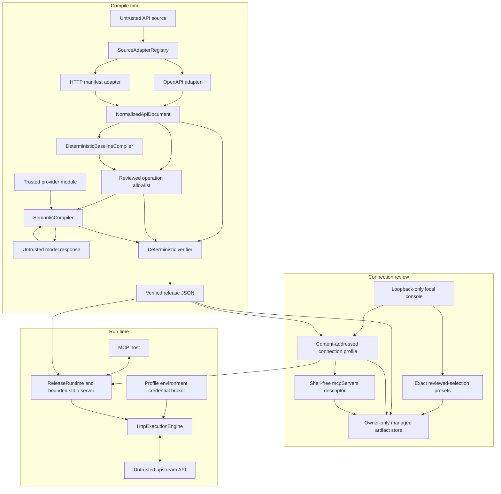
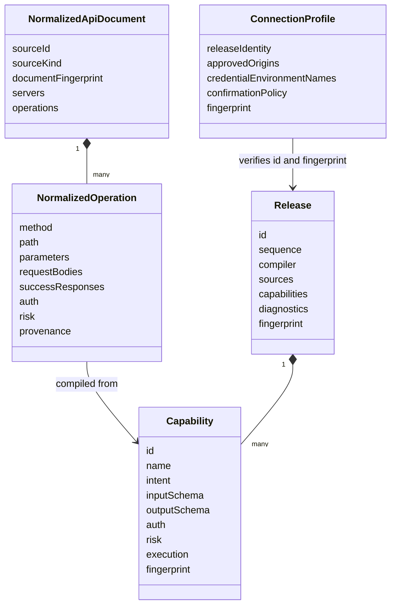

# Architecture

HiMCP is a source-neutral capability compiler and policy-enforced runtime. Its primary artifact is not generated server code; it is a validated, content-addressed release that can be reviewed independently of the MCP transport and HTTP executor. A separate connection profile binds that release to reviewed destinations and runtime credential names without turning either artifact into a secret store.

## System flow

The CLI and local console coordinate the flow but do not replace the core contracts. `compile`, its `register` alias, and the console registration endpoint call the same public compilation pipeline without invoking Commander, a shell, or a child process. Each package can be embedded separately.

## Layers and contracts

### 1. Source adapter registry

`@hi-mcp/source-adapter-core` defines a small `SourceAdapter` contract:

- `probe(input)` returns bounded confidence and a reason;
- `adapt(input)` returns an adapter ID, a `NormalizedApiDocument` or failure, and diagnostics.

The registry validates adapter IDs, rejects duplicates, validates probe output, and validates every successful normalized document at the boundary. With `--source-type auto`, all registered probes run and the only candidate above the confidence threshold must beat the runner-up. No match and equal-confidence ambiguity both fail closed. With `--source-type <id>`, the registry selects that adapter directly and rejects an unknown ID.

The built-in CLI registry contains:

- `openapi` for OpenAPI 3.x JSON or YAML;
- `http-manifest` for the strict HiMCP `schemaVersion: '1.0'`, `kind: http` contract.

Embeddings can register more adapters without coupling them to MCP, semantic providers, or runtime code. Every adapter must normalize into the same source-neutral IR before compilation.

The shared parser accepts JSON, YAML, bytes, or a programmatic plain object. It applies byte, node, depth, and YAML-alias budgets; rejects Proxy values before reflection; inspects descriptors without invoking accessors; rejects unsafe keys and non-JSON values; and discards the partial document on error. The CLI independently bounds files and stdin before constructing the complete source string and applies a smaller limit to configuration files.

### 2. Built-in source adaptation

The OpenAPI adapter accepts OpenAPI 3.x and normalizes server targets, parameters, request bodies, 2xx/default response contracts, authentication metadata, operations, and source provenance. Internal JSON Pointer references are audited with cycle, depth, unsafe-segment, object-shape, and global node-budget checks. Recursive schema components are rebased into local definitions so emitted schemas are self-contained. For OpenAPI 3.0, `$ref` siblings are ignored for standalone Reference Objects and Schema Objects, while `nullable` and the boolean forms of `exclusiveMinimum` and `exclusiveMaximum` are converted into their JSON Schema 2020-12 equivalents. OpenAPI 3.1 preserves Schema Object JSON Schema siblings and the Reference Object `summary`/`description` overrides allowed by that version; malformed dialect-specific values fail adaptation.

External `$ref` values are rejected unless a library caller supplies an explicit resolver; the stock CLI deliberately exposes no resolver. The reference layer carries the containing document URI forward, so a nested relative reference is resolved against the external document that contains it rather than always against the root. Supported recursive external schema graphs are rebased into deterministic local `$defs`; external `$dynamicRef` and `$recursiveRef` targets fail closed because their cross-document dynamic scope cannot be bundled deterministically. Resolver results must be bounded, finite, plain JSON-like values without accessors, symbols, Proxies, unsafe keys, cycles, or excessive depth. Accepted external results are cached by scoped reference, canonicalized in reference-name order, and fingerprinted. That external-dependency fingerprint is incorporated into the normalized document fingerprint with the root document, so changing a resolved result changes operation, capability, and release provenance. The resolver remains trusted for URI schemes, network access, byte and time limits, and reproducible selection of content.

The HTTP manifest adapter gives APIs without OpenAPI the same normalized boundary. It requires explicit servers, operation IDs, HTTP methods, paths, 2xx/default response contracts, schemas, authentication metadata, and optional risk metadata. It supports path, query, header, and cookie parameters and request bodies serialized as JSON, shallow form data, scalar text, or canonical padded base64 decoded to request bytes. Parameter `contentType` has deterministic serializers only for JSON/concrete `+json` and scalar `text/*`; style-based serializers accept only provably scalar, scalar-array, or closed shallow-object domains, with narrower rules for `deepObject` and cookies. `allowReserved: true`, nested structured wire values, style/content conflicts, request wildcard media ranges, and unsupported encodings fail verification. Alternate request representations share one body path and use a generated or explicit content-type selector, so identical schemas remain deterministic. This is sufficient for REST, GraphQL over HTTP, explicitly declared SOAP/XML requests, and opaque binary request payloads represented as base64.

Both adapters feed the same text-wire contract. Raw header parameters require VCHAR or Latin-1 `obs-text` at their edges and admit HTAB/SP only internally, because Fetch trims leading and trailing HTTP whitespace. URL-oriented style parameters, form field names and values, and scalar text request bodies admit only well-formed Unicode, excluding lone UTF-16 surrogates. JSON parameter content is a separate representation: a header still accepts an arbitrary JSON value because runtime serialization converts non-ASCII UTF-16 units to ASCII `\uXXXX` escapes before the field-value check.

Both stock adapters apply the shared operation-path validator before normalization. It rejects control characters, unpaired Unicode surrogates, URL component delimiters, backslashes, malformed percent encoding, encoded separators, and literal or repeatedly encoded dot segments. Path/query parameter names, query credential targets, server URLs, and server variables also require well-formed Unicode. Adapters preserve the source server template while canonicalizing the executable resolved URL, and the verifier rejects a resolved URL that would change under WHATWG serialization.

The manifest is declarative and contains no code hook. It does not introspect GraphQL schemas or WSDL. Multipart requests, streaming, binary-response preservation, native gRPC, WebSockets, SDK calls, and non-HTTP execution require a future schema and execution driver rather than model-generated behavior.

### 3. Capability IR

`@hi-mcp/capability-ir` defines the versioned boundary shared by every stage.

Canonical JSON serialization and SHA-256 fingerprints make document, operation, capability, release, and connection-profile identity reproducible. Release identity excludes wall-clock timestamps and provider request IDs while retaining stable compilation evidence. Fingerprints establish content identity, not publisher identity or signature trust.

### 4. Deterministic baseline

`DeterministicBaselineCompiler` maps normalized operations into executable capabilities:

- parameters and request bodies become an object-root input JSON Schema, including conditional body/content-type selector contracts for alternate representations;
- base64 body fields are intersected with the shared canonical padded RFC 4648 pattern, so the MCP schema rejects invalid wire input even when the source supplied only a general string schema;
- raw header, URL-oriented parameter, shallow form, and scalar text body fields are intersected with their shared HTTP field-value or well-formed-Unicode wire schemas;
- successful response schemas become the output contract;
- HTTP method, path, servers, bindings, auth metadata, and provenance are copied from the normalized operation;
- risk is derived conservatively from HTTP semantics unless the source provides a valid stricter contract;
- the tool name comes from a normalized operation ID, falling back to a stable operation identifier; collisions after normalization receive deterministic operation-derived suffixes, independent of source declaration order.

This baseline is the immutable authority used to review semantic proposals. The model is never asked to invent an endpoint, authentication mechanism, wire serialization, or transport.

The public compile pipeline also accepts an optional normalized-operation allowlist. It always builds the complete deterministic baseline first, so collision-safe MCP tool names and retained capability fingerprints do not change when neighboring operations are excluded. It then selects baseline entries by exact, case-sensitive operation ID and passes only those entries to semantic compilation, verification, compilation evidence, and release creation. The complete normalized document remains available for source grounding. Omitted selection preserves the CLI's all-operation behavior; an explicitly empty, duplicate, or unknown selection fails closed.

### 5. Optional semantic compilation

`@hi-mcp/semantic-compiler` separates model access from model choice:

1. Configured modules create `SemanticModelProvider` instances.
2. Providers discover their current model descriptors rather than relying on fixed model names.
3. `SemanticModelRouter` filters candidates against required capabilities, context, output size, allowlists, availability, latency, and cost ceilings.
4. Remaining candidates are ranked using configurable quality, cost, latency, and availability weights.
5. `SemanticCompiler` requests a schema-constrained `SemanticProposal` and tries ranked candidates in order.

A proposal can change only tool naming, title, description, intent, and existing input-field annotations. Its schema has no execution, authentication, output, provenance, or authoritative risk fields. Application checks the baseline fingerprint and re-fingerprints the result. Model risk output is recorded only as an observation.

Deterministic compilation is the default. Provider code is loaded only when the operator supplies both `--semantic` and an explicit `--config` containing an enabled provider. Local paths additionally require `allowLocal: true` and a configured entry-file SHA-256 digest. Provider modules remain trusted in-process code; an entry-file hash neither verifies their dependency graph nor creates a sandbox.

### 6. Deterministic verification

`@hi-mcp/deterministic-verifier` parses each capability and independently checks:

- input, output, binding, request-body, and response JSON Schemas;
- absolute executable HTTP(S) server URLs and supported URL components;
- path-template and path-parameter agreement;
- prototype-safe binding paths, requiredness, duplicate targets, serialization, and conservative schema-to-wire compatibility proofs;
- parameter content/style exclusivity, `allowReserved` policy, concrete request media types, and request-body representation selectors;
- canonical padded base64, raw-header field-value, well-formed-Unicode scalar text, and closed shallow form wire domains;
- output and 2xx/default success-response consistency, status precedence, supported response media ranges, and same-tier overlap rejection;
- authentication alternatives, referenced schemes, prototype-safe API-key names, and credential/tool target separation;
- conservative risk invariants;
- source-operation fidelity and immutable baseline fields;
- capability and release fingerprint integrity.

The compile pipeline verifies each semantic or baseline result against its normalized operation and deterministic baseline. Strict compilation blocks warnings as well as errors by default. A centralized `verifyRelease` boundary parses unknown input, recomputes release identity, rejects duplicate capability IDs and tool names, and verifies every capability. When `validate --source` is used, the source goes through the selected adapter again before comparison. The compiler, CLI validator, connection workflow, and runtime all apply this boundary before trusting a release.

### 7. Connection profile and export

`connection create` accepts only a persistent, verified release. It derives the canonical origins from every compiled server and requires the operator to approve every and only those origins with repeatable `--approve-origin` values. The content-addressed profile records:

- the release path, ID, and fingerprint;
- exact canonical HTTP(S) origins;
- whether reviewed plain HTTP is allowed;
- `per-call` or coarse `process` confirmation policy;
- credential binding contracts and environment-variable names.

The profile schema has no credential-value field. Generated environment names are scoped to the release fingerprint and scheme; `--credential-env <scheme=ENV_NAME>` supplies a validated string that the workflow interprets as an environment-variable name. It cannot distinguish a secret that happens to satisfy identifier syntax, so callers must supply names rather than material. Profile creation rejects an unsupported required authentication contract rather than producing a launcher that will fail open.

`connection export` verifies the profile and referenced release, then emits a product-neutral `mcpServers` object with a direct executable and argument array. The descriptor is shell-free and invokes the built CLI `dist/bin.js`, `serve-profile`, and an absolute profile path. It has no inline environment or secret field.

Release, profile, and descriptor writes are atomic, owner-only, and fail if the destination exists unless `--force` is explicit. Protected artifact relationships fail closed even with `--force`: a release cannot alias its source, a profile cannot alias its release, and a descriptor cannot alias its profile or referenced release.

### 7a. Local review console

`@hi-mcp/web` serves the React UI and JSON API from one loopback origin. Its source editor obtains the installed adapter IDs from `SourceAdapterRegistry`, then renders analysis, operations, diagnostics, origins, authentication bindings, and capabilities from normalized or verified data. No API product, credential scheme, model, or AI host is encoded as a fixed UI catalogue.

The console compiles deterministically with semantic execution disabled. Analysis returns a review fingerprint bound to the selected adapter, normalized document fingerprint, and sorted operation ID/fingerprint pairs. Registration requires that fingerprint and a non-empty operation-ID allowlist, normalizes the submitted source again, and rejects a stale review or any selection that is not exactly grounded in the current document. The client also discards an in-flight analysis response if the source changes before it returns.

The browser represents operation selection as a default included/excluded value plus sparse exceptions and an incrementally maintained selected count. Search text is indexed per analysis and the query is deferred during interactive filtering. The operation explorer measures rendered row heights, builds a variable-height layout, and mounts the visible range with a viewport-sized overscan plus the current roving-focus row. Accessible row indices and total row count continue to describe the complete filtered table. If resize observation is unavailable, it falls back to rendering the complete list. Bulk selection is intentionally outside the virtual window: it receives all IDs in the complete filtered result, so rendering remains a presentation optimization rather than a selection-authority boundary.

Reviewed selections can be persisted as exact presets. The client submits the transient source, reviewed analysis fingerprint, preset name, and exact included IDs; the server re-runs source adaptation and calls the same `reviewOperationSelection` boundary used by registration before storage. A preset is an immutable, sorted allowlist tied to its source scope and exact analysis fingerprint, not a dynamic search or tag rule. Therefore a later operation cannot become selected automatically. Presets in the same source scope with a different analysis fingerprint remain discoverable as stale but the client does not apply them. List responses contain bounded metadata and `includedOperationCount`, never every allowlist ID. Apply requests lazy-load one detail only when the selected summary's analysis and selection fingerprints still match; the detail is consumed directly into sparse selection state rather than cached with the list. Reusing a preset identity with different selection content fails rather than overwriting it; deletion is explicit.

A stale preset has a separate explicit re-review endpoint. The request includes the transient current source, its reviewed analysis fingerprint, and the selection fingerprint from the bounded list snapshot. The server recomputes the discovery scope, reanalyzes the source, loads and verifies the exact saved record, and returns the saved/current ID intersection, saved IDs now missing, and current IDs outside the saved selection. The client validates that partition against its current analysis before showing it. Loading the intersection is a second user action and creates only a new browser selection candidate; registration still reanalyzes and authorizes the final exact list. No operation equivalence or rename is inferred.

Contract comparison is independent of preset storage. `compareReleaseToDocument` accepts a verified baseline release and a fresh normalized document, creates a complete deterministic baseline, and compares capabilities by normalized operation ID. It classifies executable destinations, authentication, enforced risk fields, request bindings, response contracts, input/output schema assertions, schema annotations, and tool metadata while excluding timestamps, content fingerprints, document-level provenance fingerprints, and descriptive execution-field annotations from false-positive executable changes. Results are deterministically fingerprinted. A comparison is read-only and never updates selection, release, preset, profile, or descriptor state. Because a baseline release can be a reviewed subset, `added` means absent from that release rather than proven absent from its historical source.

The current on-disk schema keeps metadata and the exact allowlist in one `preset.json`. Listing therefore reads and verifies records sequentially before projecting summaries, even though the aggregate HTTP payload and browser state omit their ID arrays. If measured local disk parsing becomes a bottleneck, a versioned summary sidecar can optimize discovery while detail and deletion continue to verify the full authoritative record.

The complete deterministic baseline is created before applying the allowlist, preserving stable tool names across subsets. Only retained operations enter the release and compilation evidence. Per-operation authentication metadata contains only schemes referenced by that operation, so excluded operations cannot leave extra origins or credential contracts in the subset release, connection profile, or runtime environment requirements. A request cannot name a provider module, command, executable, launcher argument, output path, or data directory. Compilation uses a content-derived `himcp://source/...` location. Preset discovery instead hashes adapter ID, source kind, normalized display filename and title, and canonical document-level origins; when no usable root origin exists, the sorted operation-origin set is a documented fallback. Version and operation revisions normally retain discovery lineage, while filename, title, or root-origin changes start a new scope. These hints are not authorization: application still requires the exact analysis fingerprint and reviewed operation IDs. Source text is bounded and remains request-scoped. The managed store persists release JSON and minimal source metadata, including the original operation count for selected/total review, then connection profiles and descriptors after review. It separately persists exact selection-preset metadata and operation IDs, but not raw source text, schemas, origins, authentication contracts, or credential names or values.

Registration and connection directories use content-addressed IDs under the configured data root. Selection presets use `.himcp/console/selection-presets/<scope>/<preset>/preset.json` by default. Managed files are written through owner-only temporary paths and atomically renamed. Preset reads require owner-only directories and files, open files without following symbolic links, reject files with more than one hard link, enforce identifier/count/byte limits, parse a strict record schema, and recompute selection, record, and identity fingerprints. Preset deletion first atomically renames the verified directory to a tombstone before removal. Release/profile/descriptor reads keep their existing relationship and content re-verification. Repeated registration of identical content returns the already verified release. These controls are not an immutability or authorization boundary against another process running as the same operating-system user. The browser must approve every and only the origins derived from that release. Credential inputs are validated and interpreted as environment-variable names, while the backend derives location, target, and prefix from verified authentication metadata; identifier syntax cannot prove that a submitted string is not secret material.

The web server binds only to a loopback address. The API validates loopback Host headers and, for every method other than `GET` or `HEAD`, requires an exact same-origin `Origin`, `Sec-Fetch-Site: same-origin` when present, and a random CSRF header obtained from the same-origin status endpoint. This includes selection-preset `DELETE`. It serves no CORS policy. Production rejects protocol upgrades; development accepts only Vite HMR upgrades on the same loopback-bound HTTP listener instead of opening Vite's default wildcard WebSocket port. The console is therefore a local operator surface for one operating-system user; it is not a remotely authenticated or multi-tenant control plane.

### 8. MCP runtime

`@hi-mcp/runtime` verifies release JSON, requires object-root input schemas, rejects duplicate tool names, and maps capabilities to MCP tools. Risk metadata becomes MCP annotations, but runtime enforcement uses the verified `requiresConfirmation` flag rather than client hints.

Embeddings can provide an authoritative per-call approval callback. A rejection or callback error cannot be bypassed by coarse process approval. A connection profile defaults to `per-call`; because the current stdio `serve-profile` command has no interactive callback, confirmation-required calls remain blocked. Creating the profile with `--approve-confirmation-required` records coarse `process` approval for every confirmation-required call handled by that process.

`serve-profile` verifies the profile and its referenced release at startup. For each capability it currently selects the first compiled server target, derives its origin, requires an exact match in the profile, and gives only that origin to the HTTP execution policy. The low-level `serve` command instead requires explicit `--allow-host` rules, unless a development-only compiled-host trust switch is chosen, and does not install the profile credential broker.

The current server transport is stdio. Release files, profile files, inbound JSON-line messages, argument depth, argument nodes, and aggregate string bytes are bounded before further processing. MCP messages remain on stdin/stdout; operational logs belong on stderr or an injected trace sink.

### 9. Credentials and HTTP execution

The profile environment broker reads only the variables declared in the verified profile, only after destination validation. It releases material only to an exact approved origin and only through the location and prefix fixed by the release authentication contract. It tries complete authentication alternatives and fails closed when required material is absent.

Supported stock mappings are:

| Source authentication metadata             | Runtime mapping                                              |
| ------------------------------------------ | ------------------------------------------------------------ |
| `apiKey` in `header`, `query`, or `cookie` | Raw environment value in that exact target                   |
| HTTP `basic`                               | Environment value prefixed with `Basic ` in `Authorization`  |
| HTTP `bearer`                              | Environment value prefixed with `Bearer ` in `Authorization` |
| OAuth 2.0 or OpenID Connect                | Already-issued environment token prefixed with `Bearer `     |

Digest challenge exchange, HMAC or other dynamic signing, mTLS certificates, OAuth discovery, authorization, token exchange, and refresh are not implemented by the stock broker. They require an embedding with a destination- and principal-aware `CredentialProvider` and any corresponding transport configuration.

API-key header and cookie targets must be valid HTTP tokens. Header targets that control connection routing or message framing, including `Host`, `Connection`, `Content-Length`, and `Transfer-Encoding`, are rejected in Capability IR before a profile or MCP tool can be created.

`@hi-mcp/execution-engine` validates bounded tool input, binds path/query/header/cookie/body fields, validates the destination, resolves credentials, dispatches with manual redirect handling, parses a bounded response, validates response and capability output schemas, applies explicit output redaction, and emits a sanitized trace. Parameter content serializes JSON values or scalar text; JSON header content is rendered as ASCII JSON with `\uXXXX` escapes for non-ASCII UTF-16 units. Style-based parameters and URL-encoded forms execute only the shallow text domains proven by the verifier. Request-body serializers are JSON, URL-encoded form, scalar text, and canonical base64-to-bytes, and request content types must be concrete. Static operation paths are revalidated before binding, bound values cannot form repeatedly encoded dot segments, and the final normalized pathname must remain beneath the selected server base path.

Runtime predicates mirror the compiled text patterns. Raw tool-input headers outside the HTTP ByteString field-value range and lone surrogates in URL-oriented values, form data, or scalar text bodies fail with `BINDING_FAILED` before dispatch. Cookie names and values are component-encoded, so delimiters cannot create a second cookie. Invalid header, query, or cookie material returned by a credential provider fails separately with `CREDENTIAL_RESOLUTION_FAILED`.

Actual HTTP success is restricted to 2xx. The engine chooses response contracts by exact status, then matching class, then `default`; within the selected status tier it prefers a matching typed media contract over an untyped fallback. A response is rejected when no compiled media contract is selected. Runtime `allowedContentTypes` is an additional restriction and `allowMissingContentType` cannot make a typed-only contract match. Verification rejects overlapping media contracts inside one tier, so declaration order cannot change the result. Responses are parsed as bounded JSON or UTF-8 text; opaque binary response preservation is not supported.

The total execution deadline begins before DNS and credential work. The default Undici transport connects through a per-attempt lookup restricted to the public address set returned by the verified DNS snapshot while retaining the original hostname for HTTP Host and TLS SNI. IPv4-mapped IPv6 addresses are first canonicalized so compressed, expanded, hexadecimal, and embedded-dotted spellings all receive the underlying IPv4 public/private decision. Redirects, URL credentials, non-public addresses, and fetch-forbidden methods (`CONNECT`, `TRACE`, and `TRACK`) are rejected. An injected fetch implementation remains a trusted embedding boundary because it is responsible for honoring the verified destination snapshot.

Retrying is limited to safe or idempotent operations unless an idempotency-key header is configured. An explicit capability classification of `non-idempotent` takes precedence over GET/read/side-effect heuristics, while an explicit operator policy remains the only direct classification override. Process isolation and independent network egress policy remain recommended defense in depth.

## Failure and fallback rules

| Failure                                                     | Diagnostic or runtime result                  | Policy                                               |
| ----------------------------------------------------------- | --------------------------------------------- | ---------------------------------------------------- |
| Unknown or ambiguous source adapter                         | Selection error                               | Stop before adaptation                               |
| Parse, normalization, or adapter error                      | Error; no safe document                       | Stop compilation                                     |
| Optional provider, discovery, routing, or semantic failure  | Warning; retain deterministic baseline        | Strict mode stops; non-strict mode may continue      |
| Required semantic failure                                   | Error; baseline retained only for diagnostics | Stop compilation                                     |
| Verifier error                                              | Error                                         | Stop compilation, validation, connection, or serving |
| Existing output without `--force`                           | Write refusal                                 | Preserve existing artifact                           |
| Profile/release identity or exact-origin mismatch           | Verification error                            | Refuse export or serving                             |
| Missing or unsupported required credential                  | Profile or execution error                    | Refuse profile creation or call                      |
| Confirmation required without callback/process approval     | Runtime policy error                          | Refuse call                                          |
| Schema, destination, timeout, response, or upstream failure | Sanitized typed execution error               | Refuse or retry only under verified policy           |

## Extension points

- Add a source adapter that emits `NormalizedApiDocument`; do not couple it to MCP.
- Add a semantic provider module that returns live model descriptors and structured proposals.
- Embed the runtime with a custom `CredentialProvider`, `TraceSink`, per-call approval callback, and execution policy.
- Add another execution kind only by versioning Capability IR and implementing matching source schema, verification, and runtime behavior together.

Changes to IR or trust boundaries should include an architecture decision record. Current decisions are [Capability IR](adr/0001-capability-ir.md), [semantic and deterministic separation](adr/0002-semantic-deterministic-split.md), [stdio runtime](adr/0003-stdio-runtime.md), [source adapters and connection profiles](adr/0004-source-adapter-registry-and-connection-profiles.md), [reviewed operation subsets](adr/0005-reviewed-operation-subsets.md), [exact reviewed-selection presets](adr/0006-reviewed-selection-presets.md), and [release contract diff and stale-preset re-review](adr/0007-release-contract-diff-and-preset-rereview.md).
