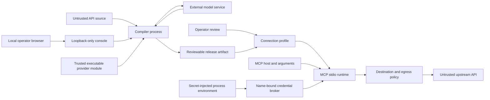

# Security model

HiMCP narrows the gap between an untrusted API description and an executable MCP tool, but it is not a sandbox, secret manager, or authorization system. This document describes implemented controls, their boundaries, and the responsibilities that remain with the operator.

## Assets to protect

- Upstream API credentials and delegated user identity.
- The integrity of normalized endpoints, methods, bindings, schemas, authentication, provenance, and risk metadata.
- Reviewed destination policy and connection-profile identity.
- The host running the MCP process and its network reachability.
- MCP client data supplied as tool arguments.
- Confidential data returned by an upstream API.
- Audit and trace data that may reveal operational metadata.

## Trust boundaries

API sources, external-reference results, model responses, release and profile files, MCP arguments, DNS results, environment values, and API responses are untrusted data. Configured semantic-provider modules and custom resolvers, credential providers, fetch implementations, and policy hooks are trusted executable boundaries because they run with the process's permissions.

The local MCP host and operating-system user are the caller authorization boundary for stdio. A valid profile authorizes neither a remote principal nor every possible local process.

The local console uses the operating-system user and loopback origin as its setup boundary. It has no remote-user identity, remote authorization, or tenant isolation and must not be exposed through a public listener or reverse proxy.

## Compile-time controls

### Bounded, fail-closed source selection

The CLI incrementally bounds source files and stdin before constructing the complete string and bounds configuration files separately. The shared source parser applies input-byte, plain-data-node, object-depth, and YAML-alias limits. Programmatic object inputs are inspected through descriptors: Proxies and accessors are rejected without invocation, arrays must be contiguous, values must be finite JSON-like data, unsafe prototype-related keys are rejected, and any error discards the partial document.

Automatic adapter selection is not a format guess followed by best-effort parsing. Every registered adapter returns validated confidence metadata, and exactly one adapter must win above the configured threshold. No match and equal-confidence ambiguity fail closed. Operators can choose `openapi` or `http-manifest` explicitly with `--source-type`.

The OpenAPI adapter adds reference-depth and global resolved-node limits, rejects unsafe JSON Pointer segments, diagnoses cycles, and rebases supported recursive schemas into local definitions. OpenAPI 3.0 ignores `$ref` siblings for standalone Reference Objects and Schema Objects, so ignored siblings and their external references do not affect execution or dependency identity. OpenAPI 3.1 keeps Schema Object JSON Schema siblings and only the standalone Reference Object `summary`/`description` overrides allowed by that version. The adapter also converts OpenAPI 3.0 `nullable` and boolean exclusive bounds into the shared JSON Schema dialect rather than letting runtime validation interpret mixed dialects. Invalid OpenAPI 3.0 dialect values fail adaptation. External references are rejected unless a library caller supplies an explicit resolver; the stock CLI has no resolver option.

A custom resolver remains responsible for URI schemes, origin policy, network access, byte limits, timeouts, caching, and reproducible content selection. Nested references are scoped to the URI of the external document that contains them. Returned values are accepted only after bounded sanitization rejects Proxies, accessors, symbols, unsafe keys, cycles, non-finite values, excessive depth, and excessive nodes. Supported recursive external schema references are bundled into local `$defs`; an external `$dynamicRef` or `$recursiveRef` is rejected because cross-document dynamic scope is not implemented. Accepted results are sorted by scoped reference and fingerprinted as an external dependency graph. That fingerprint is included in the normalized document fingerprint with the root OpenAPI document, so changing a resolver result changes downstream provenance and release identity. This detects content changes; it does not authenticate where the content came from.

The HTTP manifest parser has the same shared data-safety boundary plus a strict schema. Input-path segments and API-key parameter names reject `__proto__`, `prototype`, and `constructor`. It can declare HTTP requests for REST, GraphQL over HTTP, SOAP/XML text, and base64-decoded request bytes, but only through implemented wire domains. JSON/concrete `+json` and scalar text parameter content are supported; style-based parameters and forms require conservatively provable scalar or closed shallow shapes. `allowReserved: true`, nested structured wire values, wildcard request media types, malformed media parameters, unsupported encodings, and ambiguous style/content combinations fail verification. For base64 bodies, compilation automatically intersects the MCP input field with the canonical padded RFC 4648 pattern and runtime decoding applies the same predicate. The manifest cannot introduce executable code. Multipart, streaming, binary responses, native gRPC, WebSockets, SDK-only calls, and non-HTTP transports are rejected or remain unrepresentable instead of being invented by a model.

Compilation similarly narrows text inputs instead of trusting an upstream schema to describe JavaScript/HTTP conversion limits. Raw header values require VCHAR or Latin-1 `obs-text` at both edges and allow HTAB/SP only internally. Fetch trims leading and trailing HTTP whitespace, so accepting it would mutate opaque tool or credential values after validation. Style-based URL values, form field names and values, and scalar text bodies are intersected with a well-formed-Unicode domain that excludes lone surrogates. Verification requires those constraints to remain in the capability input schema. JSON header content is intentionally exempt from scalar narrowing: its arbitrary JSON value is serialized to ASCII, with non-ASCII UTF-16 units represented as `\uXXXX` escapes, before the raw field-value predicate runs.

Operation paths are rejected when URL parsing could reinterpret their structure: this includes query/fragment delimiters, backslashes, control characters, unpaired Unicode surrogates, malformed percent encoding, encoded separators, and dot segments visible only after repeated percent decoding. Static path/query names, query credential targets, server URLs, and server-variable names and values also require well-formed Unicode. Source adapters canonicalize executable resolved URLs; verification and runtime reject a non-canonical resolved URL. Runtime additionally rejects bound values that become dot segments and verifies the normalized target path remains under the compiled server base path before destination or credential work can lead to a request.

### Constrained semantic changes

Model output must satisfy `SemanticProposalSchema`. The schema cannot express endpoint, method, server, binding, authentication, output schema, provenance, wire serialization, or authoritative risk changes. A proposal is tied to a capability ID and baseline fingerprint. Applying it updates only permitted semantic fields and verifies that immutable contract material did not change.

Provider catalogues and generated proposals are inspected as bounded plain JSON-compatible data before recursive schema parsing. Configurable stage timeouts and concurrency limits bound the compiler-facing workflow; provider adapters must honor the propagated `AbortSignal` to terminate their own network or compute work.

The model prompt includes capability metadata and schemas. Treat that information as disclosed to the selected provider. Do not include secrets, customer records, or private examples in source descriptions or generated releases.

### Provider plugin risk

Deterministic compilation is the CLI default. Provider code executes only when the operator supplies `--semantic`, an explicit `--config` path, and an enabled provider. Local paths require both `allowLocal: true` and an entry-file SHA-256 digest. Package entry files may also be checked when an integrity value is configured.

These checks make provider selection intentional and detect a changed entry file; they do not validate the dependency graph or sandbox execution. Provider packages can read files, environment variables, and network resources available to the compiler. Treat them like privileged build tooling:

- pin and review package versions and dependencies;
- run compilation with minimal filesystem and network permissions;
- expose only the provider credential needed by that process;
- never load a module named by an untrusted API source;
- isolate the compiler when the module is not fully trusted.

Shape validation occurs after module initialization and cannot sandbox initialization, factory code, dependencies, or network activity.

### Verification, identity, and file writes

The verifier checks executable contracts against the normalized source and deterministic baseline. This includes conservative schema-to-wire proofs, request media syntax, response status/media selection, and authentication target ownership. The compiler, validator, connection workflow, and runtime use the centralized `verifyRelease` boundary to parse unknown artifacts, verify each capability, reject duplicate identities and tool names, and recompute release identity before use. Baseline compilation gives normalized-name collisions stable operation-derived suffixes, while release verification still rejects a tampered duplicate. Connection profiles independently bind the referenced release ID and fingerprint and recompute their own content identity.

Canonical SHA-256 fingerprints detect accidental or malicious artifact mutation; they do not prove who produced an artifact. Releases and profiles are not signed. Protect them with artifact-store and filesystem access control and review diffs before deployment.

Release, profile, and launcher-descriptor files are created atomically with owner-only permissions. Existing destinations are preserved unless the operator explicitly supplies `--force`. Even with `--force`, alias checks prevent a release from overwriting its source, a profile from overwriting its release, and a descriptor from overwriting its profile or referenced release. `--output -` writes to stdout and transfers confidentiality responsibility to the caller.

### Local console controls

The console refuses non-loopback binding. Every request must carry a loopback Host header. Every mutation method (all methods other than `GET` and `HEAD`) additionally requires an exact same-origin `Origin`, a random `X-HiMCP-CSRF` token read from the same-origin status endpoint, and `Sec-Fetch-Site: same-origin` when the browser supplies that header. The rule includes selection-preset `DELETE`; it is not limited to JSON `POST`. The server emits a restrictive CSP, denies framing and MIME sniffing, has no CORS response, rejects `OPTIONS`, and caps headers, request bodies, source bytes, samples, and persisted artifact reads. Production rejects protocol upgrades. Development accepts only Vite HMR upgrades on the console's existing loopback listener; it does not create Vite's separate wildcard WebSocket listener.

Console compilation is deterministic-only. Browser requests cannot enable a semantic provider, load a module, launch a command, choose a filesystem path, or change the runtime executable and arguments. Uploaded names are bounded display labels and never become storage paths. The compiler receives a content-derived logical URI instead of a host path.

Raw source text is not persisted by the console. The managed store retains verified releases and minimal display metadata, then profiles and descriptors produced from those releases. It also stores exact reviewed-selection presets at `.himcp/console/selection-presets/<scope>/<preset>/preset.json` by default. A preset contains normalized name and source/analysis identity metadata, exact sorted operation IDs, counts, timestamps, and fingerprints. It excludes raw source text, request/response schemas, origins, authentication contracts, and credential names or values. Operation IDs themselves are metadata and can reveal API structure, so the preset directory is not public content.

Preset directories and files are owner-only, scope/preset IDs are allow-listed, and creation writes a private temporary directory and file before atomic rename and directory synchronization. Reads require private directories, use no-follow file opens, reject symbolic links and files with multiple hard links, enforce byte/count/identifier limits, parse a strict schema, and recompute selection and record fingerprints. Deletion verifies the preset, atomically renames its directory to a tombstone, and then removes it. A same-name preset for one exact analysis cannot be silently replaced with different selected IDs. Release, profile, and descriptor storage retains its existing atomic writes and re-verification controls. These controls protect the storage boundary from browser-supplied paths, but they do not make files immutable to another process already running as the same operating-system user.

The server does not trust a browser-authored preset allowlist. Creation receives the source only for that request, re-runs source adaptation, verifies the exact analysis fingerprint and operation IDs through the shared registration selection boundary, and persists only the resulting exact list. A preset from a different analysis fingerprint is returned as stale and cannot be applied by the UI. List responses omit operation IDs and expose only bounded metadata plus the included count. The detail endpoint returns one allowlist only when the caller presents the matching analysis and selection fingerprints; registration still reanalyzes the source and remains the authoritative boundary. No tag, search, or future-operation rule is stored, so contract expansion cannot silently grant a new tool.

Stale-preset re-review is a mutation-protected request because it accepts transient source text and returns one saved allowlist partition. It verifies same-origin and CSRF controls, recomputes the current source scope and analysis fingerprint, verifies the saved selection fingerprint, and returns only exact ID intersection/missing/unselected sets. The browser verifies that the response partitions its current operations. Loading candidates requires another explicit action, never includes a current operation absent from the previous selection, and still has no authority to register them.

Contract diff accepts one stored, re-verified release and transient current source. The current analysis fingerprint must match the browser-reviewed analysis before comparison. The implementation compares explicit contract fields rather than trusting capability fingerprints, since document-level provenance changes can legitimately refingerprint otherwise unchanged capabilities. It is read-only and does not persist the source or diff, mutate selection, or authorize execution. A baseline subset cannot prove whether an absent capability was absent from the historical source, so additive results are described only relative to the release.

The UI exposes credential bindings as environment-variable-name fields, and the API validates every submitted binding string with environment-variable identifier syntax and interprets it as a name. Identifier validation cannot distinguish a secret that happens to use the same syntax, so operators must never paste credential material into those fields. Authentication location, parameter target, and prefix are derived from verified release metadata. The exported descriptor contains a server-computed Node executable, CLI entry, and managed profile path, but no environment map or runtime-resolved credential value. API documents themselves can contain sensitive descriptions, defaults, or examples that flow into a release, so operators must remove secrets before submission even though the raw source is transient.

## Connection-profile controls

### Exact origin review

`connection create` derives canonical origins from every server in the verified release. The operator must provide every and only those origins with `--approve-origin`; missing and unrelated origins are rejected. Origins include scheme, hostname, and effective port and exclude credentials, paths, queries, and fragments.

`serve-profile` verifies the profile and release again. For each capability it currently selects the first compiled server target, derives that target's origin, requires exact membership in the profile, and supplies only that origin to the execution engine. This origin check is additive: the engine still rejects URL credentials, insecure HTTP without explicit review, non-public DNS results, DNS rebinding, redirects, and fetch-forbidden methods (`CONNECT`, `TRACE`, and `TRACK`).

Origin review is not a guarantee that every path on the origin is safe. The verified capability path and binding contract, upstream authorization, and independent egress policy remain important.

### Credential-name artifacts and runtime values

Connection profiles define authentication metadata and syntactically validated environment-variable names, not a credential-value field. Launcher descriptors emit a shell-free command and argument array and deliberately omit an `env` map. Capability IR and release JSON can preserve source-derived descriptions, defaults, examples, and schemas, so they are not a secret-detection or secret-scrubbing boundary; prompts and diagnostics likewise must be handled according to their documented disclosure paths.

Generated environment-variable names are deterministically namespaced by release fingerprint and scheme to reduce cross-release confusion. `--credential-env <scheme=ENV_NAME>` supplies a string that is validated and interpreted as a name and must still refer to a verified release scheme. A credential that itself looks like a valid identifier cannot be distinguished from a name at this boundary. The runtime reads a value only from the profile-declared name, after destination validation, and does not serialize that runtime-resolved value back into a profile or descriptor.

Credential material is assembled in null-prototype maps. Credential targets are derived from the verified authentication schemes: duplicate normalized targets are rejected, and a header, query, or cookie binding controlled by MCP input cannot share an authentication target. API-key header and cookie names must be valid HTTP tokens; routing and framing headers such as `Host` and `Content-Length` cannot be API-key targets. Header comparisons are case-insensitive. There is no global special case that reserves `X-API-Key`; it is blocked only when a declared authentication scheme owns that target or another header policy applies.

Resolved credential values cross a second runtime boundary. Header material must satisfy the raw HTTP field-value predicate, query names and values must be well-formed Unicode, and cookie values must contain neither control characters nor lone surrogates before component encoding. Invalid material raises `CREDENTIAL_RESOLUTION_FAILED` before it can enter the request.

Environment variables are process-local secret delivery, not a secret manager. Other code with access to the process or its environment may read them. Start the MCP process from a secret-aware host or wrapper, limit process privileges, and rotate values outside HiMCP.

### Supported static authentication

The stock profile broker supports only authentication that can be represented as static material placed into a verified HTTP target:

- `apiKey` in the declared header, query parameter, or cookie;
- HTTP Basic material in `Authorization` with the `Basic ` prefix;
- HTTP Bearer material in `Authorization` with the `Bearer ` prefix;
- an already-issued OAuth 2.0 or OpenID Connect bearer token.

For Basic, the environment value is the credential payload after the scheme prefix; HiMCP does not collect a username/password pair or negotiate authentication. For OAuth and OpenID Connect, it does not perform discovery, authorization, client-credential exchange, scope negotiation, token refresh, revocation, or expiry management.

Digest challenge exchange, HMAC and custom request signing, mTLS client certificates, hardware-backed keys, and other dynamic schemes are not supported by the stock broker. If a required capability has no complete static supported alternative, profile creation fails. An embedding may supply a purpose-built `CredentialProvider` and transport, but that provider must:

- authorize the principal for the specific capability and exact destination;
- choose the minimum required scopes;
- honor cancellation and deadlines;
- prevent arbitrary header, query, or cookie injection;
- never return material for a different origin;
- avoid logging secret values.

Authentication to an upstream API is not authorization to invoke an MCP tool.

## Runtime controls

### Release, profile, and argument validation

The runtime applies centralized release verification, rejects duplicate tool names, and requires MCP input schemas to have an object root. Release, profile, and inbound stdio messages have byte or structural limits before recursive parsing. Tool arguments are inspected with depth, node, and aggregate-string limits before execution; non-plain objects and prototype-sensitive object keys are rejected, and binding lookup uses own properties only.

The execution engine bounds input and output JSON complexity and schema depth, nodes, properties, strings, collection sizes, and regular-expression patterns. It validates full tool input and individual bindings before dispatch and validates selected response schemas and the capability output schema before returning data. Process-level CPU and memory isolation remain separate defenses.

### Destination and SSRF policy

The default execution policy:

- requires HTTPS unless reviewed plain HTTP is explicitly enabled;
- rejects credentials embedded in destination URLs;
- requires an exact operator policy derived from a connection origin or `--allow-host` rule;
- resolves DNS and rejects loopback, link-local, private, documentation, multicast, and other non-public ranges, canonicalizing compressed, expanded, hexadecimal, and embedded-dotted IPv4-mapped IPv6 spellings before applying the IPv4 policy;
- rejects localhost and local-domain names;
- repeats destination validation before each attempt;
- uses an Undici connector whose lookup is restricted to the verified DNS snapshot while preserving the original hostname for HTTP Host and TLS SNI;
- handles redirects manually and rejects redirect responses;
- rejects `CONNECT`, `TRACE`, and `TRACK` before credential resolution or dispatch.

The low-level `serve` command requires at least one `--allow-host <hostname[:port]>`. `--trust-compiled-hosts` is a development-only escape hatch that derives trust from release destinations instead of independent operator review. The profile workflow uses exact origins and does not use that shortcut.

Allowing HTTP never makes private addresses acceptable under the default policy. A custom `DestinationPolicy` or fetch implementation is trusted. Injected fetch receives a verified destination snapshot but must connect to it; otherwise it can reintroduce DNS-rebinding exposure. Independent egress enforcement remains recommended defense in depth.

The total execution deadline starts before DNS validation and credential resolution and propagates through those interfaces. Response size and retry count are bounded separately.

### Side effects and confirmation

The deterministic baseline classifies risk conservatively and records `risk.requiresConfirmation`. `ReleaseRuntime` gates every capability with that verified flag regardless of the descriptive risk level. MCP annotations are client hints; the runtime gate is the enforcement point.

An embedding can supply an authoritative `approveConfirmationRequired` callback for each call, including capability, inspected input, and execution context. Callback rejection or failure cannot be overridden by coarse process approval.

A connection profile defaults to `per-call`, but the current stdio `serve-profile` command has no interactive callback. Therefore confirmation-required calls remain blocked in the default profile. `--approve-confirmation-required` records `process` mode and approves all such calls handled by that process. Use it only when every confirmation-required capability and caller workflow has been reviewed. This is not user-by-user or call-by-call consent.

The low-level `serve --allow-confirmation-required` option has the same coarse limitation. Capabilities without `requiresConfirmation` are outside this gate; hosts can impose stricter authorization or approval policy.

Retries default to one attempt. Additional retries are allowed only for safe/idempotent operations or when an idempotency-key header is configured. A capability explicitly classified as `non-idempotent` is not promoted to safe by GET, read-level, or side-effect-none heuristics; only an explicit operator classification override or idempotency-key policy can permit retry. Upstream behavior can still differ from its declared contract, so review state-changing endpoints independently.

### Request, response, and telemetry handling

The HTTP engine supports JSON, URL-encoded shallow form, scalar UTF-8 text, and canonical base64-decoded request bodies. Parameter content supports full JSON values or scalar text; style-based parameter serializers operate only on the scalar, scalar-array, and closed shallow-object domains proven during verification. Runtime uses the shared raw-header and well-formed-Unicode predicates again: invalid tool-input text raises `BINDING_FAILED` before Fetch, while cookie components are percent-encoded so delimiters remain data. Query `allowReserved: true` is not executed. Request content types must be concrete and syntactically valid; wildcard ranges, control characters, multipart generation, per-property form encodings, and streaming are not supported. XML and SOAP are sent as declared scalar text; GraphQL is executed as an explicitly declared HTTP request.

Only actual 2xx statuses are successful. A response contract is selected by exact status, matching class, then `default`; a matching typed media contract wins over an untyped fallback within that tier. If no compiled media contract is selected, parsing stops. A runtime `allowedContentTypes` list only narrows the compiled contract, and `allowMissingContentType` cannot select a typed-only response without its media type. Verification rejects overlapping response media ranges inside one status tier, including concrete, type wildcard, suffix wildcard, and full wildcard intersections. Responses are bounded, content-type checked, decoded as UTF-8, and parsed as JSON or text. Outputs are complexity-checked and schema-validated. Binary response preservation and arbitrary content encodings/codecs are not supported.

Recursive sensitive-key redaction is available for telemetry. Returned output is redacted only at explicit paths so implicit rewriting cannot silently violate the output schema. Execution traces include destination protocol, hostname, port, path template, status, size, timing, attempts, outcome, and caller-supplied attributes. They intentionally omit request headers and bodies, but custom attributes can still be sensitive. Treat the trace sink as security-relevant storage.

## Deployment checklist

- Select the source adapter explicitly in automation, or verify the reported automatic selection.
- Review normalization diagnostics and run `diff <release> <source>` or the console contract comparison before replacing a release.
- Pin the expected source and release fingerprints; for a custom external resolver, make content selection reproducible.
- Run `validate --source --source-type <adapter>` against the exact bundled source.
- Keep `compile.strict` enabled unless every warning is understood.
- Prefer deterministic compilation. If enrichment is needed, use explicit `--semantic --config`, pin providers, and verify local entry-file integrity.
- Review every release origin and create a connection profile with exact `--approve-origin` values.
- Inject credential values into only the generated or reviewed environment names; never add values to source, configuration, release, profile, or launcher files.
- Confirm that the authentication mode is static and supported; embed a purpose-built provider for signing, mTLS, or token lifecycle work.
- Leave coarse confirmation approval disabled; use an embedding with per-call approval when confirmation is required.
- Run compiler and runtime processes with separate least-privilege identities.
- Enforce network egress independently of the Node.js process.
- Set response, timeout, retry, redaction, and trace-retention policy for the API.
- Keep source, release, profile, stdio-message, argument, schema, and response limits appropriate for deployment.
- Keep operational logs off stdout while MCP stdio is active.
- Protect artifacts and consider external signing or attestation.

## Out of scope in the current version

- Sandboxing provider modules, resolver code, credential providers, custom transports, or the MCP host.
- Authentication and multi-tenant authorization for a remote MCP endpoint.
- Remote hosting, authentication, and multi-tenant authorization for the setup console.
- A stock per-call runtime approval UI or user-specific consent record; the console configures policy but does not approve live tool calls.
- Cryptographic release/profile signatures or transparency logs.
- Digest, HMAC/custom request signing, mTLS, or OAuth token lifecycle management in the stock profile broker.
- Multipart, streaming, binary response preservation, native gRPC, WebSockets, SDK calls, and non-HTTP execution.
- Content-level data loss prevention for model prompts or API outputs.
- Process-level CPU/memory isolation and independent network egress enforcement.
- Proving that an upstream implementation matches its declared OpenAPI or HTTP-manifest semantics.

For vulnerability reporting, follow the private-reporting guidance in [SECURITY.md](../SECURITY.md).
